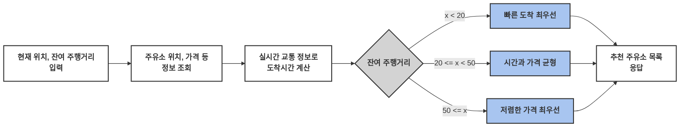

# 🚗 스마트 주유소 추천
주유소와 실시간 교통 정보를 활용한 운전자 맞춤형 주유소 추천 서비스

 

## 🚀 Flow

```mermaid
flowchart LR
    classDef defaultNode fill:none,stroke:#333333,stroke-width:2px,color:#333333,font-weight:bold;
    classDef pastelBlue fill:#a8c5f0,stroke:#333333,stroke-width:2px,color:#333333,font-weight:bold;
    classDef grey fill:#d3d3d3,stroke:#333333,stroke-width:2px,color:#333333,font-weight:bold;

    A[현재 위치, 잔여 주행거리<br>입력] --> B[주유소 위치, 가격 등<br>정보 조회]
    B --> C[실시간 교통 정보로<br>도착시간 계산]
    C --> D{"잔여 주행거리"}
    D -->|x < 20| D1[빠른 도착 최우선]
    D -->|20 <= x < 50| D2[시간과 가격 균형]
    D -->|50 <= x| D3[저렴한 가격 최우선]
    D1 --> E[추천 주유소 목록<br>응답]
    D2 --> E
    D3 --> E

    class A,B,C,E defaultNode
    class D grey
    class D1,D2,D3 pastelBlue
```

