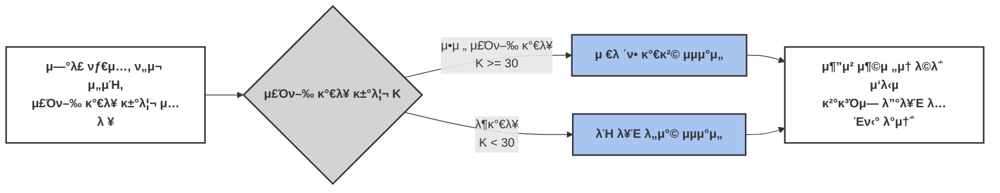

# π— μ¤λ§νΈ μ£Όμ μ† 추μ²
μ£Όμ μ†μ™€ 실μ‹κ°„ κµν†µ 정보를 ν™μ©ν• μ΄μ „μ λ§μ¶¤ν• μ£Όμ μ† μ¶”μ² μ„λΉ„μ¤

 

## π€ Story

1. μ΄μ „μμ ν„μ¬ μƒν™©μ— λ§κ² 충전μ†λ¥Ό 추μ²ν•  μ μ다.

```mermaid
flowchart LR
    classDef defaultNode fill:none,stroke:#333333,stroke-width:2px,color:#333333,font-weight:bold;
    classDef pastelBlue fill:#a8c5f0,stroke:#333333,stroke-width:2px,color:#333333,font-weight:bold;
    classDef grey fill:#d3d3d3,stroke:#333333,stroke-width:2px,color:#333333,font-weight:bold;

    A[μ—°λ£ νƒ€μ…, ν„μ¬ μ„μΉ,<br>μ£Όν–‰ κ°€λ¥ κ±°λ¦¬ μ…λ ¥] --> B{"μ£Όν–‰ κ°€λ¥ κ±°λ¦¬ K"}
    B -->|μ•μ „ μ£Όν–‰ κ°€λ¥<br>K >= 30| B1[μ €λ ΄ν• κ°€κ²© μµμ°μ„ ]
    B -->|λ¶κ°€λ¥<br>K < 30| B2[λΉ λ¥Έ λ„μ°© μµμ°μ„ ]
    B1 --> C[μ¶”μ² μ¶©μ „μ† λ©λ΅ μ‘λ‹µ<br>κ²°κ³Όμ— λ”°λ¥Έ λ…Έν‹° λ°μ†΅]
    B2 --> C
    
    class A,C defaultNode
    class B grey
    class B1,B2 pastelBlue
```

